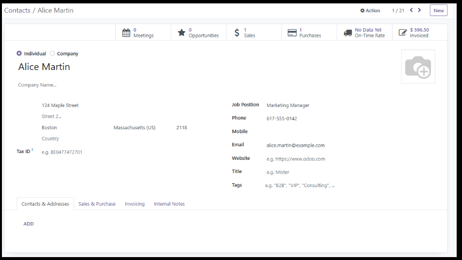
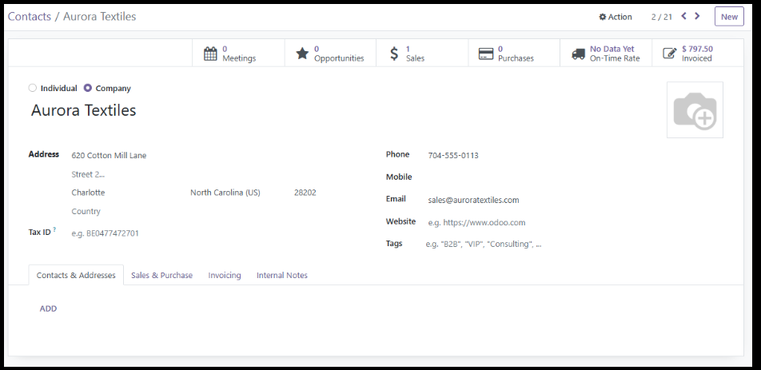
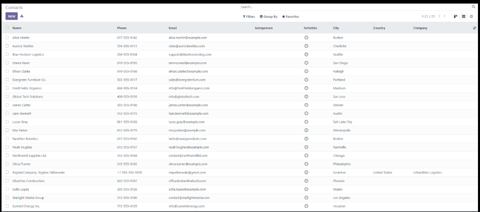
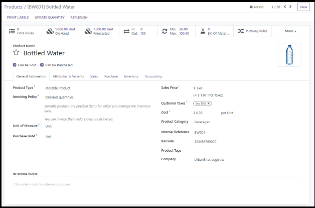
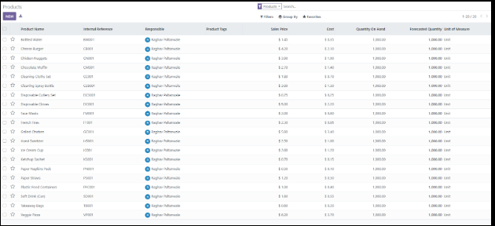
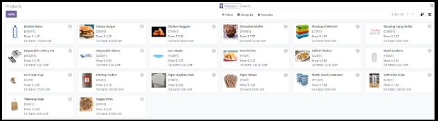
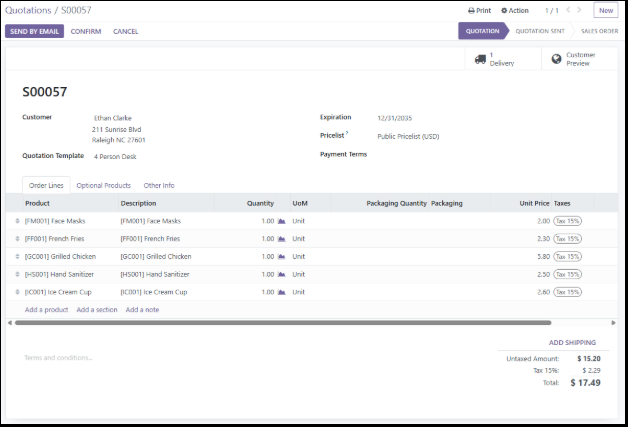
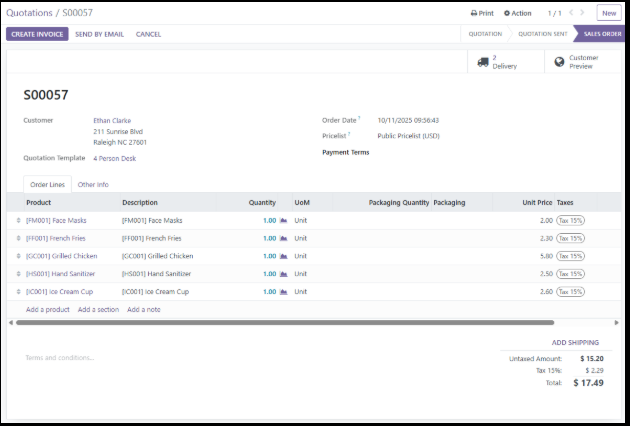
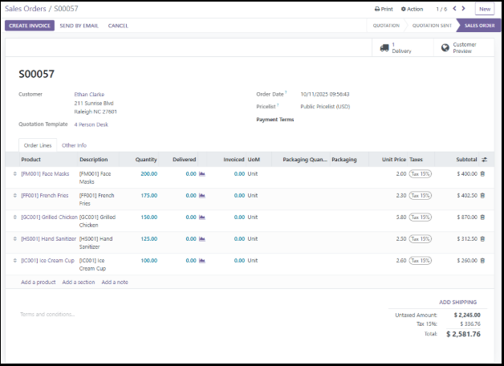

# Order 2 Cash - Odoo 16

<!-- It's common to insert a short (1-2 sentence) summary of the project here -->

## 📚 Table of Contents

- [Background Business Case](#background-business-case)
- [Goals](#goals)
- [Implementation](#implementation)
- [Process](#process)
  - [Customer](#1️⃣-customer)
  - [Products](#2️⃣-products)
  - [Quotation & Sales Orders](#3️⃣-quotation--sales-orders)
  - [Processing & Delivery](#4️⃣-processing--delivery)

## Background Business Case

This is a supply chain business case for the hypothetical company Banana Inc., a grocery store. From start to finish, this document describes how customer order processing, invoicing, order validation, delivery and payment collection is implemented in Odoo 16’s Order to Cash workflow.

## Goals

The goal of this project is to establish a new workflow for processing, invoicing, order validating, delivering and collecting payment for the business to function more smoothly. Prior to this, the company was using an outdated system. This implementation will add value by increasing order processing speed, organization, and better allocation of company resources.

## Implementation

The implementation will be carried out with an Order 2 Cash process. The order to cash (O2C) process is the entire business workflow from the moment a customer places an order to when the company receives and records the final payment.

## Process

### 1️⃣ Customer

Contacts (module) → Create the customer

The first step of this process is to create customers who will place the orders for the goods and services provided by the company. Banana Inc. has two types of customers: individual and business. My O2C model handles both of them via the Contacts module. The “Customer” object has multiple fields, such as Name, Phone, Email and City etc.

#### Individual Customer Example Form

#### Business Customer Example Form

For this business case, I created 10 individual customers and 10 business customers:

### 2️⃣ Products

Inventory (module) → Products (drop down list) → Products (option) → New

Once the customers have been created, the next priority is to design products that will be ordered by said customers and that Banana Inc. will deliver to them for the transaction. For this purpose, access the Inventory module; open the Products drop down list, select the option Products from there, and then click on New. This opens a form which provides the following fields: Product Name, Internal Reference, Sales Price, Cost, Quantity On Hand, Forecasted Quantity, Unit of Measure. There is also the option of including images for each given product.

Here is an example of the form of a water bottle:

.

I created in total 20 different products, each with a distinct image to distinguish it from the other. 

These products rangefrom Food Items, Beverages, Cleaning & Hygiene Supplies, to Packaging & Disposable Items.

### 3️⃣ Quotation & Sales Orders

Once the products have been created, the company’s next prerogative is to create the sales order. There are multiple steps to this process, starting with creating quotations. Go to the Sales module; it opens automatically at the Quotations page. Click on New, and it displays a form. This form has the following fields: Customer, Quotation Template, Expiration, Payment Terms, Products, Quantity, Unit Price etc.

Here’s an example of a quotation’s form:

The next step is to click on the “confirm” button on the top left; this converts the quotation into a sales order.

Then, update the quantities in sales order.

### 4️⃣ Processing & Delivery

The sales orders having been created, the next step is to validate them. Click on the [delivery button](Screenshots/Delivery_symbol.png) with the truck symbol on it.

This opens the [delivery order form](Screenshots/Delivery_order_form.png).

[Update the quantities](Screenshots/Delivery_quantity.png) in the “Done” column to match the corresponding quantities in the “Demand” column.

Now, [click validate (top left)](Screenshots/Delivery_validate.png). This completes the delivery process.
