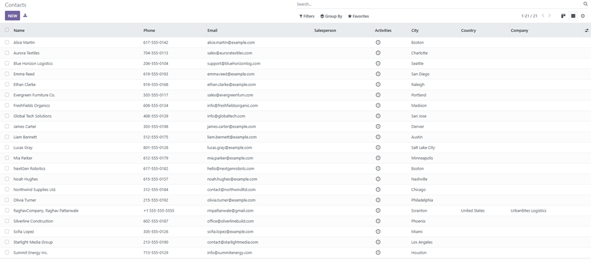
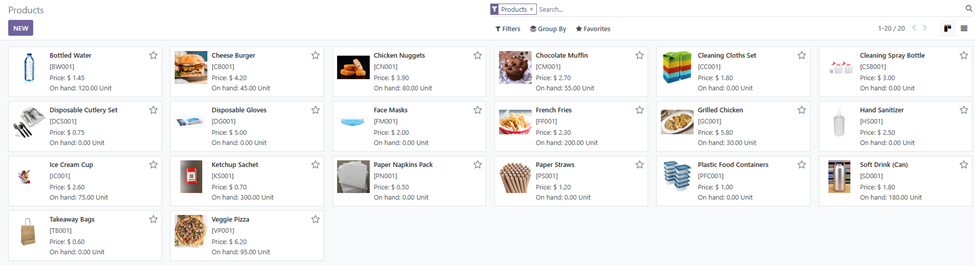

# o2c-odoo16-project
Full Order-to-Cash (O2C) workflow implemented in Odoo 16 ERP, including customer creation, sales orders, deliveries, invoicing, and payments.

- bullet 1
- bullet 2
   - bullet 3 
   - gbkjgk

[my repository](https://github.com/rmpaltanwale/o2c-odoo16-project/tree/main)
______________________________

## Table of Contents

- [Implementation](#implementation)

## more sections

Separate

## more sections 

## more sections

## more sections

[go back to top](#table-of-contents)

## jdlkjsald

## djlafjdk;aj

dhsadhklsahflkd
sahkdfjhsakjfh
safhkjsahfla
ashfkjashfjksdka
ashfdljashfl
afjlakdj

[go back to top](#table-of-contents)

## Implementation

[go back to top](#table-of-contents)

### another title 

[go back to top](#table-of-contents)
