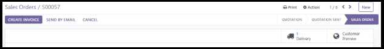

# Order 2 Cash - Odoo 16

<!-- It's common to insert a short (1-2 sentence) summary of the project here -->

## 📚 Table of Contents

- [Background Business Case](#background-business-case)
- [Goals](#goals)
- [Implementation](#implementation)
- [Process](#process)
  - [Customer](#1️⃣-customer)
  - [Products](#2️⃣-products)
  - [Quotation & Sales Orders](#3️⃣-quotation--sales-orders)
  - [Processing & Delivery](#4️⃣-processing--delivery)
  - [Invoicing & Payment collection](#5️⃣-invoicing-&-payment-collection)

## Background Business Case

This is a supply chain business case for the hypothetical company Banana Inc., a grocery store. From start to finish, this document describes how customer order processing, invoicing, order validation, delivery and payment collection is implemented in Odoo 16’s Order to Cash workflow.

## Goals

The goal of this project is to establish a new workflow for processing, invoicing, order validating, delivering and collecting payment for the business to function more smoothly. Prior to this, the company was using an outdated system. This implementation will add value by increasing order processing speed, organization, and better allocation of company resources.

## Implementation

The implementation will be carried out with an Order 2 Cash process. The order to cash (O2C) process is the entire business workflow from the moment a customer places an order to when the company receives and records the final payment. The following modules/apps are used:

## Process

### 1️⃣ Customer

Contacts (module) → Create the customer

My first step was to create customer records - the foundation of the O2C cycle. In Odoo, every sales transaction must be linked to a Contact, representing either an individual or a business entity.

#### Individual Customer Example Form

#### Business Customer Example Form

For this business case, I created 10 individual customers and 10 business customers:

Each customer profile included details such as:

- Name

- Street / City / State / ZIP

- Email / Phone

- Payment Terms

I treated this as the foundation of the O2C workflow - accurate customer data ensures proper invoicing, reporting, and follow-up communication. I wanted to capture the diversity of a mixed clientele, so both individuals and companies were included.

### 2️⃣ Products

Inventory (module) → Products (drop down list) → Products (option) → New

Once customers were in place, my next goal was to define what Banana Inc. sells. The Products section in Odoo allows configuration of items that can be sold, purchased, or stored in inventory.

Each product record included:

- Product Name and Internal Reference (e.g., BW001 for Bottled Water)

- Product Type (Storable)

- Sales Price and Cost

- Quantity on Hand / Forecasted Quantity

- Unit of Measure (e.g., Unit, Dozen)

- Image for visual distinction

Categories created:

1. Food Items - Burgers, Nuggets, Muffins

2. Beverages - Bottled Water, Soft Drinks

3. Cleaning & Hygiene Supplies - Gloves, Sanitizers, Sprays

4. Packaging & Disposable Items - Takeaway Bags, Paper Straws
Here is an example of the form of a water bottle:

.

I created in total 20 different products, each with a distinct image to distinguish it from the other. 

These products rangefrom Food Items, Beverages, Cleaning & Hygiene Supplies, to Packaging & Disposable Items.

### 3️⃣ Quotation & Sales Orders

Once the products have been created, the company’s next prerogative is to create the sales order. There are multiple steps to this process, starting with creating quotations. Go to the Sales module; it opens automatically at the Quotations page. Click on New, and it displays a form. This form has the following fields: Customer, Quotation Template, Expiration, Payment Terms, Products, Quantity, Unit Price etc.

Here’s an example of a quotation’s form:

The next step is to click on the “confirm” button on the top left; this converts the quotation into a sales order.

Then, update the quantities in sales order.

### 4️⃣ Processing & Delivery

The sales orders having been created, the next step is to validate them. Click on the delivery button with the truck symbol on it.

This opens the delivery order form.

Update the quantities in the “Done” column to match the corresponding quantities in the “Demand” column.

Now, click validate (top left). This completes the delivery process.

### 5️⃣ Invoicing & Payment Collection

Now, the final step. The delivery of the goods to the customer is not enough; the payment must be collected to complete the O2C process. 
To do this, open the Sales module, and click on the To Invoice option on the purple ribbon.

Clicking on To Invoice will open a dropdown list with the following 2 options: Orders to Invoice and Orders to Upsell. Click on Orders to Invoice. This shows the Sales Order we delivered earlier. Click on it.

The invoice form opens. Here, click on Create invoice (top left).

A prompt dialog box opens. Keep regular invoice option selected and then proceed with “Create and View Invoice”.

Draft invoice is created. To proceed, click confirm.

Customer invoice has been posted. Click on Register Payment.

Dialog box opens again. Click on Create Payment.

Payment has been processed and completed.

